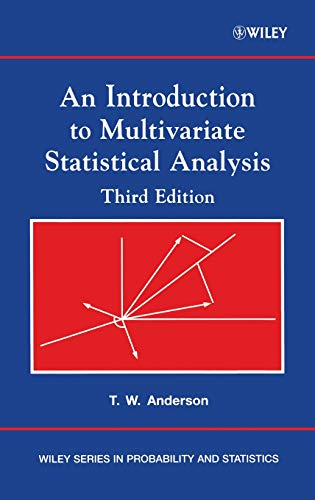

```{r, include=FALSE}
knitr::opts_chunk$set(
  comment = "#", prompt = F, message = F, warning = F
)
```

---

Nothing is better resource than a book. So, in this post, I've shared some books that have been extremely helpful to me in my quest to learn multivariate analysis.


1. Methods of Multivariate Statistics by M.S. Srivastava.   
Read the book [online](https://rebrand.ly/srivastava-multivariate-archive) or [download the pdf](https://rebrand.ly/Srivastava-Multivariate-Statistics-pdf).   
{width=250px}
2. An Introduction to Multivariate Statistical Analysis by T. W. Anderson   
[Download pdf](https://rebrand.ly/Anderson-multivariate-3rd-edition)   
{width=250px}
3. Applied Multivariate Statistical Analysis by Richard A. Johnson and Dean W. Wichern      
[Download pdf](https://rebrand.ly/Johnson-applied-multivariate)   
{width=250px}


