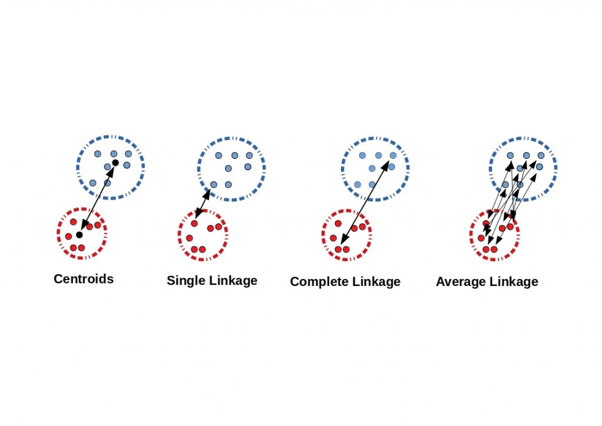

```{r, include=FALSE}
knitr::opts_chunk$set(
  comment = "#", prompt = F, message = F, warning = F
)
```

---

# Introduction

Cluster analysis is a data analysis technique that aims to identify and group observations or data points that are homogeneous, meaning they share similar characteristics or properties. It is a data mining technique and is considered an unsupervised learning algorithm that helps reveal underlying patterns and structures within the data.

Cluster analysis is a powerful tool that can be used for a variety of tasks, including:

- Customer segmentation: Cluster analysis can be used to segment customers into groups based on their purchase behavior, demographics, or other factors. This can help businesses to target their marketing campaigns more effectively.   
- Fraud detection: Cluster analysis can be used to identify fraudulent transactions by finding groups of transactions that are similar in terms of their characteristics.   
- Product recommendation: Cluster analysis can be used to recommend products to users based on their past purchase history or other factors.   
- Anomaly detection: Cluster analysis can be used to identify anomalies or outliers in data. This can be helpful for identifying fraud, detecting system errors, or identifying new trends.

---

# Types

Centroid-based clustering and Hierarchical clustering are two distinct methods commonly used in clustering analysis.

In centroid-based clustering, the number of clusters is predetermined and specified before the clustering process begins. The algorithm aims to partition the observations into the specified number of clusters by minimizing the within-cluster sum of squares.

In contrast, hierarchical clustering does not require specifying the number of clusters in advance. It generates a tree-like structure called a dendrogram, which shows the hierarchical relationships between the observations at different levels of similarity. By cutting the dendrogram at different heights, we can obtain clusterings for different numbers of clusters, ranging from 1 to the total number of observations.


## Centroid-based Clustering

This is a bottom-up approach to clustering, where objects are assigned to non-overlapping clusters based on their proximity to a central point, called a centroid. The most commonly centroid-based clustering algorithms include k-means, k-medoids, and fuzzy c-means.


## Hierarchical Clustering

Hierarchical clustering is a top-down approach to clustering that creates a hierarchy of clusters by recursively merging or splitting them based on their similarity. It can be either agglomerative (where objects are merged together to form clusters) or divisive (where clusters are split apart to form smaller clusters).


---

# R Code

## Step 1: Load Data

```{r}
df <- read.csv("df_coffee.csv")
```

Taking a sample of 20 observations for the demonstration purpose:
```{r}
set.seed(100)
df <- df[sample(1:nrow(df), size = 20),]
```

Always check descriptive statistics:
```{r}
library(skimr)
library(rlang)
skim(df)
```

Three of the variables have no variability (standard deviation of zero). So they should be removed:
```{r}
df <- dplyr::select(df, -c("Uniformity","Clean.Cup","Sweetness","Defects"))
```

We can only use numeric variables in cluster analysis functions in R for now. (There are some advanced techniques that discuss methods related to cluster analysis in mixed data types).

```{r}
df_num <- df[,-ncol(df)]  # removing the last variable in the dataset which is character type
```


## Step 2: Complete Cases

Take only complete cases:
```{r}
df_com <- na.omit(df_num)
```

## Step 3: Scaling

Scaling the dataset is important because different features may have different scales, and if they are not scaled, then the features with larger scales will have a greater influence on the clustering results.

Common scaling techniques used in clustering include standardization (subtracting the mean and dividing by the standard deviation), normalization (scaling the values to a specific range).

$X_{stand} = \frac{X - \mu_x}{\sigma_x}$   
$X_{norm} = \frac{X - X_{min}}{X_{max}-X_{min}}$   
$E[Y] = E[\Gamma'X]=\Gamma'E[X]=0$    

```{r}
# standardization
df_scaled <- data.frame(scale(df_com, center = TRUE, scale = TRUE))

# normalization
# df_scaled <- scale(df_com, 
#                    center = apply(df_com, 2, min), 
#                    scale = apply(df_com, 2, function(x) {max(x) - min(x)}))  
```


## Step 4: Optimal Number of Clusters

The optimal number of clusters depends on the specific dataset and the application. However, there are a few methods that can be used to help determine the optimal number of clusters in centroid-based clustering.

### Elbow Method

This method involves plotting the within-cluster sum of squares (WSS) as a function of the number of clusters. The WSS is a measure of how well the data points are clustered together. The elbow method works by looking for the point in the WSS curve where the rate of decrease starts to slow down. This point is often considered to be the optimal number of clusters. 
```{r}
library(factoextra)
fviz_nbclust(df_scaled, kmeans, method = "wss") +  
  geom_vline(xintercept = 2, linetype = 2) + # add line for better viz
  labs(subtitle = "Elbow method") # add subtitle
```


### Silhouette Score/Width
The silhouette score is a measure of how well each data point is clustered with its own cluster compared to other clusters. It ranges from -1 to 1, with a value of 1 indicating that the data point is perfectly clustered with its own cluster, 0 indicating the data point is on the border between the two clusters and a value of -1 indicating that the data point is equally well-clustered with two or more clusters. The optimal number of clusters is often the number that maximizes the average silhouette score.   

```{r}
fviz_nbclust(df_scaled, kmeans, method = "silhouette") +  
  labs(subtitle = "Silhouette method")
```

To compute Silhouette information for a cluster:
```{r}
library(cluster)
km_res <- kmeans(df_scaled, centers = 2)  # defining cluster

sil <- silhouette(km_res$cluster, dist(df_scaled))
plot(sil)
fviz_silhouette(sil) + theme_minimal()
```

A positive silhouette coefficient indicates that an observation is well-matched to its own cluster.


### Gap Statistic Method

The gap statistic helps determine the optimal number of clusters by comparing the observed within-cluster dispersion with a reference distribution. The idea is to select the number of clusters that maximizes the gap statistic. A larger gap indicates a more significant deviation from randomness, suggesting a better-defined clustering structure. By comparing the gaps for different numbers of clusters, we can identify the number of clusters that provides the most distinct and meaningful clustering pattern.   

```{r}
fviz_nbclust(df_scaled, kmeans, method = "gap_stat") +
  labs(subtitle = "Gap statistic method")
```


### Combination of All

But the clever way is to try out different methods and see what majority returns. See [here](https://statsandr.com/blog/clustering-analysis-k-means-and-hierarchical-clustering-by-hand-and-in-r/#elbow-method)

The `parameter` package comes to help in this case:
```{r}
library(parameters)
n_clust <- n_clusters(df_scaled,
                      package = c("easystats", "NbClust", "mclust"),
                      standardize = TRUE
                      )
print(n_clust)
plot(n_clust)
```

## Step 5: Hierarchical Clustering

### Step 5.1: Distance

#### Numeric Data

Use the function `dist()`:   
```{r}
df_dist_euc <- dist(df_scaled, method = 'euclidian')
# df_dist_max <- dist(df_scaled, method = 'maximum')
# df_dist_man <- dist(df_scaled, method = 'manhattan')
# df_dist_can <- dist(df_scaled, method = 'canberra')
# df_dist_mink <- dist(df_scaled, method = 'minkowski')
```

#### Categorical Data 

```{r}
# dist(dummified_data, method = "binary")
```

#### Gower Distance

Gower distance is a similarity measure commonly used for clustering categorical and numerical mixed data. It takes into account the different types of variables and calculates the dissimilarity between observations based on their attribute values.

For categorical variables, Gower distance measures dissimilarity as the proportion of attributes where two observations differ. For numerical variables, it calculates the standardized absolute difference between the values. The Gower distance is then calculated as the weighted sum of the dissimilarities for all variables.

```{r}
df <- dplyr::mutate_if(df, is.character, as.factor) # convert character to factor

df_dist_gower <- cluster::daisy(df, metric = "gower") # Dissimilarity Matrix Calculation
```

### Step 5.2: Linkage Criteria

Linkage refers to the way in which clusters are merged together. There are several different linkage criteria that can be used, and the choice of linkage criterion can have a significant impact on the results of the clustering -

- Complete linkage: Maximum distance between two sets   
- Single linkage: Minimum distance between two sets   
- Average linkage: Average distance between two sets   
- Ward's linkage: Minimize the total within cluster variance    




Using the Euclidean distance on the numeric data the following code finds the hierarchical clusters by different linkage methods:
```{r}
hclust_single <- hclust(df_dist_euc, method = "single")
hclust_complete <- hclust(df_dist_euc, method = "complete")
hclust_average <- hclust(df_dist_euc, method = "average")
hclust_centroid <- hclust(df_dist_euc, method = "centroid")
hclust_ward <- hclust(df_dist_euc, method = "ward.D2")
```

Get the cluster information: 
```{r}
cutree(hclust_ward, k = 2) # specify number of clusters
cutree(hclust_ward, h = 0.7) # specify height to cut
```

Summary by clusters:
```{r}
library(dplyr)
df_num %>%
  mutate(cluster = cutree(hclust_ward, k = 2)) %>% 
  group_by(cluster) %>%
  summarise(across(everything(), list(Average = mean))) 
```

Dendrogram will help to visualize as well as to determine the number of clusters to use or the height where to cut.

### Step 5.3: Dendrogram

Pass the hclust object to the plot function:
```{r}
plot(hclust_ward, hang = -1)
rect.hclust(hclust_ward, k = 2, border = "blue")
```


Using dendextend package: 
```{r}
# install.packages("dendextend")
library(dendextend)

plot(color_branches(dend = hclust_ward, k = 2)) # specify k, can also use h to specify height
plot(color_branches(dend = hclust_ward, k = 2), 
     # parameters for nodes
     nodePar = list(col = 3:2, 
                    cex = c(1.5, 0.75), 
                    pch =  21:22,
                    bg =  c("light blue", "pink"),
                    lab.cex = 0.75, 
                    lab.col = "tomato"))
```

```{r}
# function to get color labels; Change color and cut based on number of clusters
colLab <- function(n, labelColors = c("#036564", "#EB6841"), cut = 2) {
  clusMember = cutree(hclust_ward, cut)
  if (is.leaf(n)) {
    a <- attributes(n)
    labCol <- labelColors[clusMember[which(names(clusMember) == a$label)]]
    attr(n, "nodePar") <- c(a$nodePar, lab.col = labCol)
  }
  n
}

hclust_ward %>% 
  color_branches(k = 2, col = c("#036564", "#EB6841")) %>% 
  dendrapply(colLab) %>%  # applying to all nodes
  plot()  # finally plotting
```


```{r}
library("ape")
plot(as.phylo(hclust_ward), type = "unrooted", cex = 0.7, no.margin = T)
```

## Step 5: K-means Clustering

Categorical data cannot be passed to the kmeans() function in R. The kmeans() function uses the Euclidean distance metric to calculate the distance between observations, and this metric is not defined for categorical data.

```{r}
km <- kmeans(df_scaled, centers = 2) # centers specify number of clusters
km
```

Visualizing clusters:
```{r}
fviz_cluster(km, df_scaled, ggtheme = theme_minimal())
```

Visualizing clusters in terms of variables in the dataset:
```{r}
library(ggplot2)
df_km <- mutate(df_num, cluster = km$cluster)
df_km %>% ggplot(aes(x = Aroma, y = Aftertaste)) + 
  geom_point(aes(color = as.factor(cluster))) +
  labs(color = "Clusters") + theme_minimal()
```

Summary on clusters:
```{r}
df_km %>%
  group_by(cluster) %>%
  summarise(across(everything(), list(Average = mean))) 
```

---

# References

1. ISLR   
2. https://uc-r.github.io/kmeans_clustering   
3. https://statsandr.com/blog/clustering-analysis-k-means-and-hierarchical-clustering-by-hand-and-in-r/#elbow-method   
4. https://www.gastonsanchez.com/visually-enforced/how-to/2012/10/03/Dendrograms/   

